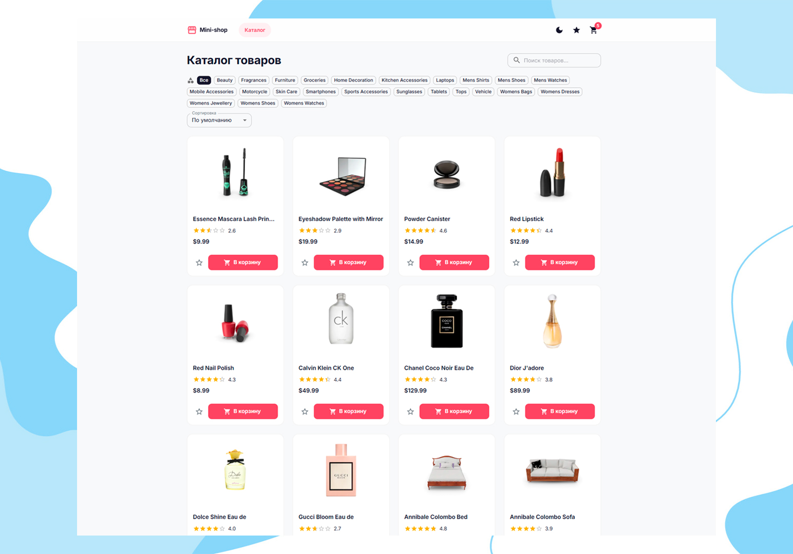
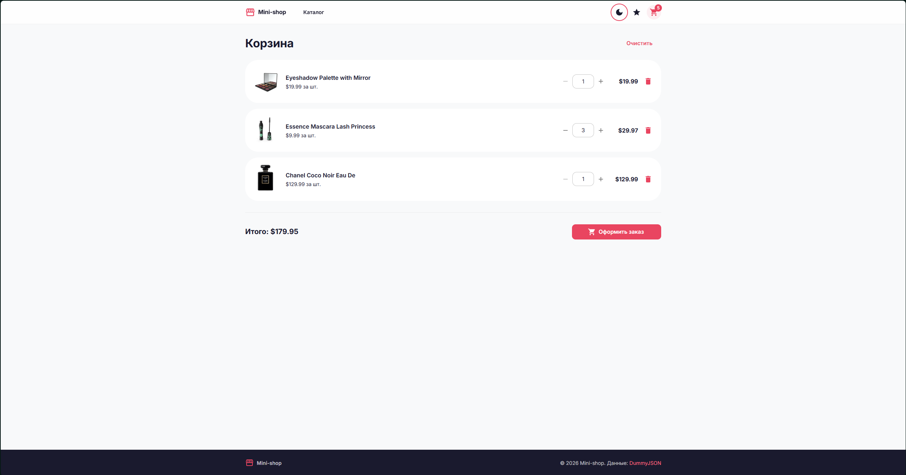
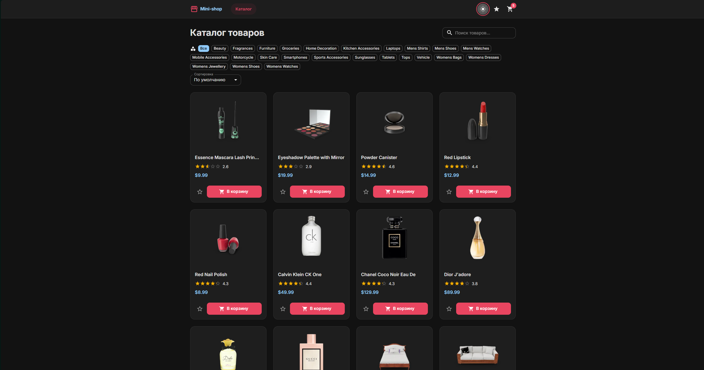
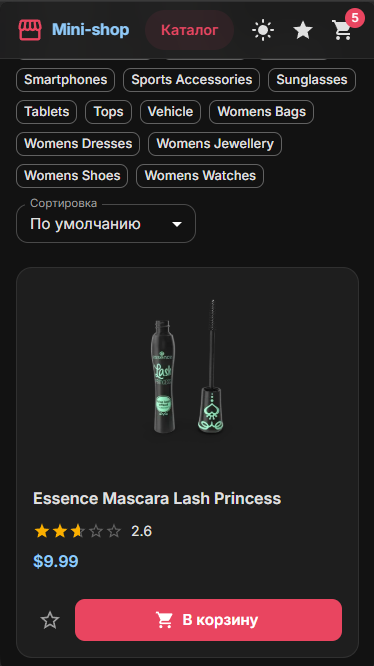
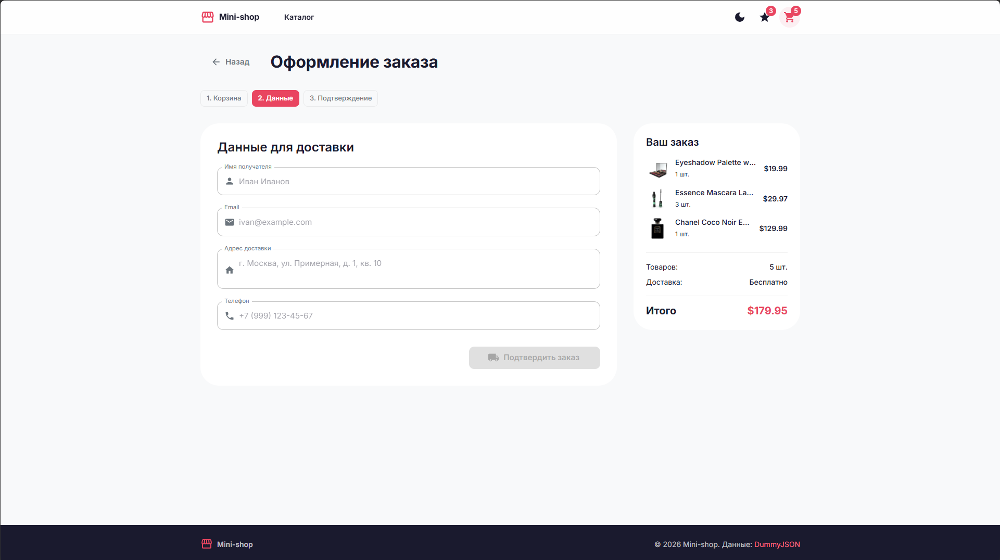
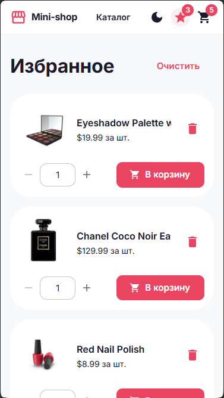

# Mini-shop



## Оглавление

- [Mini-shop](#mini-shop)
  - [Оглавление](#оглавление)
  - [Обзор](#обзор)
    - [Задача](#задача)
    - [Функциональность](#функциональность)
    - [Скриншоты](#скриншоты)
  - [Продакшн](#продакшн)
  - [Используемый стек](#используемый-стек)
    - [Сторонние сервисы](#сторонние-сервисы)
  - [Быстрый старт](#быстрый-старт)
    - [Предварительные требования](#предварительные-требования)
    - [Установка и запуск](#установка-и-запуск)
    - [Сборка для продакшна](#сборка-для-продакшна)
    - [Линтинг](#линтинг)
    - [Деплой на GitHub Pages](#деплой-на-github-pages)
  - [Структура проекта](#структура-проекта)
  - [Ключевые решения](#ключевые-решения)
    - [Архитектура приложения](#архитектура-приложения)
    - [Работа с API и кеширование](#работа-с-api-и-кеширование)
    - [Глобальное состояние](#глобальное-состояние)
    - [Маршрутизация и ленивая загрузка](#маршрутизация-и-ленивая-загрузка)
    - [Тема и доступность](#тема-и-доступность)
    - [Валидация и обработка ошибок](#валидация-и-обработка-ошибок)
  - [Маршруты](#маршруты)
  - [Автор](#автор)

## Обзор

### Задача

Создать витрину интернет-магазина — одностраничное приложение (SPA) с каталогом товаров, корзиной, оформлением заказа и избранным. Данные загружаются из открытого API [DummyJSON](https://dummyjson.com). Вёрстка выполнена на компонентах [Material UI](https://mui.com/) с кастомной темой.

### Функциональность

- **Каталог товаров** — сетка карточек с пагинацией, поиском, фильтрацией по категориям и сортировкой по цене/рейтингу.
- **Детальная страница товара** — полная информация: изображение, описание, характеристики, отзывы, наличие, доставка, возврат.
- **Корзина** — добавление/удаление товаров, изменение количества (1–999), подсчёт итоговой суммы. Состояние сохраняется в `localStorage`.
- **Оформление заказа** — трёхшаговый процесс: корзина → форма доставки (валидация имени, email, адреса, телефона) → подтверждение.
- **Избранное** — добавление товаров в избранное через иконку-звёздочку. Состояние сохраняется в `localStorage`.
- **Тёмная/светлая тема** — переключение с сохранением выбора в `localStorage`.
- **Адаптивность** — корректное отображение на мобильных, планшетах и десктопе.

### Скриншоты

|                  Desktop (светлая тема, каталог)                   |
| :----------------------------------------------------------------: |
|  |

|                 2K Desktop (тёмная тема)                  |                 Мобильный вид (тёмная тема)                  |
| :-------------------------------------------------------: | :----------------------------------------------------------: |
|  |  |

|                   Оформление заказа (Desktop)                    |                      Избранное (мобильный вид)                       |
| :--------------------------------------------------------------: | :------------------------------------------------------------------: |
|  |  |

## Продакшн

Демо сайта с кэшированными маршрутами доступно по ссылке: https://zendrolya.github.io/mini-shop/

## Используемый стек

| Технология                                             | Версия    | Назначение                                                                                     |
| :----------------------------------------------------- | :-------- | :--------------------------------------------------------------------------------------------- |
| **[React](https://react.dev/)**                        | `^19.2.7` | UI-библиотека. Функциональные компоненты, хуки, контекст.                                      |
| **[TypeScript](https://www.typescriptlang.org/)**      | `~6.0.2`  | Строгая типизация всей кодовой базы.                                                           |
| **[Vite](https://vite.dev/)**                          | `^8.1.0`  | Сборщик и dev-сервер. Мгновенная загрузка модулей, горячая замена кода.                        |
| **[MUI](https://mui.com/)**                            | `^9.1.2`  | Библиотека UI-компонентов (Material Design). Кастомизация через `createTheme`.                 |
| **[Emotion](https://emotion.sh/)**                     | `^11.14`  | CSS-in-JS движок, используемый MUI для стилизации.                                             |
| **[React Router](https://reactrouter.com/)**           | `^7.18.0` | Клиентская маршрутизация. Ленивая загрузка страниц через `React.lazy`.                         |
| **[TanStack React Query](https://tanstack.com/query)** | `^5.101`  | Управление серверным состоянием: кеширование, фоновые обновления, обработка ошибок и загрузки. |
| **[ESLint](https://eslint.org/)**                      | `^10.5.0` | Линтер. Включает Prettier, React Hooks, React Refresh плагины.                                 |
| **[Husky](https://typicode.github.io/husky/)**         | `^9.1.7`  | Git-хуки. Pre-commit проверка перед коммитом.                                                  |


### Сторонние сервисы

| Сервис           | Описание                                                                                                                                                       |
| :--------------- | :------------------------------------------------------------------------------------------------------------------------------------------------------------- |
| **DummyJSON**    | REST API с моковыми данными. Используются эндпоинты `/products`, `/products/search`, `/products/category-list`, `/products/category/{slug}`, `/products/{id}`. |
| **Google Fonts** | Шрифт Inter (400, 500, 600, 700) загружается через CDN.                                                                                                        |

## Быстрый старт

### Предварительные требования

- **Node.js** >= 18
- npm, yarn или pnpm

### Установка и запуск

```bash
# 1. Клонируйте репозиторий
git clone https://github.com/zendrolya/mini-shop.git
cd mini-shop

# 2. Установите зависимости
npm install

# 3. Запустите dev-сервер
npm run dev
```

Приложение будет доступно по адресу `http://localhost:5174`.

### Сборка для продакшна

```bash
npm run build
```

Результат будет в папке `dist/`. Сначала выполняется проверка типов (`tsc -b`), затем сборка Vite.

### Линтинг

```bash
npm run lint
```

Проверяет стиль кода и форматирование (Prettier встроен в ESLint). Автоисправление:

```bash
npm run lint --fix
```

### Деплой на GitHub Pages

```bash
npm run deploy
```

Скрипт собирает проект и публикует содержимое `dist/` в ветку `gh-pages`.

## Структура проекта

```
mini-shop/
├── screenshots/                  # Скриншоты для README
├── src/
│   ├── assets/                   # Статические ресурсы
│   ├── components/               # React-компоненты
│   │   ├── Layout.tsx            # Общий layout: шапка (AppBar), навигация, футер
│   │   ├── ThemedApp.tsx         # Обёртка с ThemeProvider и провайдерами контекстов
│   │   ├── ProductCard.tsx       # Карточка товара в каталоге
│   │   ├── SearchInput.tsx       # Поле поиска товаров
│   │   ├── CategoryFilter.tsx    # Фильтр по категориям ( Chips )
│   │   ├── SortSelect.tsx        # Выпадающий список сортировки
│   │   ├── Pagination.tsx        # Навигация по страницам
│   │   ├── OrderForm.tsx         # Форма оформления заказа с валидацией
│   │   ├── OrderConfirmation.tsx # Экран подтверждения заказа
│   │   ├── StepsIndicator.tsx    # Индикатор шагов (Корзина → Данные → Подтверждение)
│   │   └── EmptyState.tsx        # Заглушка для пустых состояний
│   ├── context/                  # React Context для глобального состояния
│   │   ├── CartContext.tsx       # Провайдер корзины (useReducer + localStorage)
│   │   ├── CartCtx.ts           # Создание контекста корзины
│   │   ├── FavoritesContext.tsx  # Провайдер избранного (useReducer + localStorage)
│   │   ├── FavoritesCtx.ts      # Создание контекста избранного
│   │   ├── ColorModeContext.tsx  # Провайдер темы (light/dark + localStorage)
│   │   ├── ColorModeCtx.ts      # Создание контекста темы
│   │   ├── ToastContext.tsx      # Провайдер уведомлений (snackbar)
│   │   └── ToastCtx.ts          # Создание контекста уведомлений
│   ├── hooks/                    # Кастомные хуки
│   │   ├── useCart.ts            # Хук для работы с корзиной
│   │   ├── useFavorites.ts       # Хук для работы с избранным
│   │   ├── useColorMode.ts       # Хук для переключения темы
│   │   ├── useProducts.ts        # Хук для получения списка товаров (с пагинацией, поиском, категорией)
│   │   ├── useProduct.ts         # Хук для получения одного товара по ID
│   │   ├── useCategoryProducts.ts# Хук для получения списка категорий
│   │   └── useToast.ts           # Хук для показа уведомлений
│   ├── pages/                    # Страницы (ленивая загрузка)
│   │   ├── CatalogPage.tsx       # Главная — каталог с поиском, фильтрами, сортировкой, пагинацией
│   │   ├── ProductPage.tsx       # Детальная страница товара
│   │   ├── CartPage.tsx          # Корзина + оформление заказа + подтверждение
│   │   └── FavoritesPage.tsx     # Список избранных товаров
│   ├── services/                 # Слой работы с API
│   │   ├── api.ts                # Базовая функция getResource<T> с обработкой ошибок
│   │   └── products.ts           # Функции для запросов к DummyJSON
│   ├── theme/
│   │   └── theme.ts              # Конфигурация темы MUI (светлая/тёмная палитра, компоненты)
│   ├── types/                    # TypeScript-интерфейсы
│   │   ├── product.ts            # Product, ProductsResponse, SortOption
│   │   └── cart.ts               # CartItem
│   ├── App.tsx                   # Корневой компонент: Routes + Lazy loading
│   ├── main.tsx                  # Точка входа: провайдеры (QueryClient, BrowserRouter, ColorMode)
│   └── index.css                 # Базовые стили, шрифт Inter
├── index.html                    # HTML-точка входа
├── vite.config.js                # Конфигурация Vite
├── tsconfig.json                 # Конфигурация TypeScript (общая)
├── tsconfig.app.json             # Конфигурация TypeScript для приложения
├── eslint.config.js              # Конфигурация ESLint + Prettier
├── package.json                  # Зависимости и скрипты
├── AI_REPORT.md                  # Отчёт о работе с AI на протяжении разработки
└── README.md                     # Документация проекта
```

## Ключевые решения

### Архитектура приложения

Приложение построено по принципу разделения ответственности:

- **`services/`** — чистый слой работы с API. Функция `getResource<T>` инкапсулирует `fetch`, обработку HTTP-ошибок и типизацию ответа. Конкретные функции (`getProducts`, `searchProducts`, `getProduct`) вызывают `getResource` с нужными путями.
- **`hooks/`** — кастомные хуки инкапсулируют логику получения данных и работы с состоянием. Хуки `useProducts` и `useProduct` используют `@tanstack/react-query` для кеширования и управления состоянием запросов.
- **`context/`** — глобальное состояние (корзина, избранное, тема, уведомления) через React Context + `useReducer`. Каждый провайдер сам управляет персистентностью через `localStorage`.
- **`pages/`** — страницы связывают хуки и компоненты, содержат только UI-логику и обработчики событий.

### Работа с API и кеширование

Все запросы к DummyJSON проходят через единую функцию `getResource<T>` (`services/api.ts`), которая:

- Бросает кастомный `ApiError` с кодом статуса при неудачном ответе.
- Поддерживает `AbortSignal` для отмены запросов при размонтировании компонента.

Для кеширования используется `@tanstack/react-query`. Ключ запроса `['products', { query, category, page }]` автоматически инвалидируется при изменении параметров поиска, категории или страницы.

**Проблема и решение:** API-эндпоинт `/products/category/{slug}` не поддерживает параметр `q=` для поиска. При одновременной активации категории и поискового запроса фильтрация выполняется на стороне клиента через `matchesQuery()` в хуке `useProducts`.

### Глобальное состояние

Три независимых контекста управляют состоянием приложения:

| Контекст           | Хранит                       | Персистентность | Механизм     |
| :----------------- | :--------------------------- | :-------------- | :----------- |
| `CartContext`      | Товары в корзине, количество | `localStorage`  | `useReducer` |
| `FavoritesContext` | Избранные товары             | `localStorage`  | `useReducer` |
| `ColorModeContext` | Режим темы (light/dark)      | `localStorage`  | `useState`   |

Корзина и избранное используют `useReducer` с типизированными экшенами (`ADD_ITEM`, `REMOVE_ITEM`, `UPDATE_QUANTITY`, `CLEAR_CART` и т.д.). Инициализация происходит из `localStorage` через функцию `loadInitialState()`, что защищает от повреждённых данных.

**Валидация количества:** Количество товара в корзине ограничено диапазоном 1–999. При вводе значения за пределами диапазона оно автоматически округляется. Значение 0 или отрицательное удаляет товар из корзины.

### Маршрутизация и ленивая загрузка

Маршруты определены в `App.tsx` через `react-router-dom`:

```tsx
<Route element={<Layout />}>
  <Route index element={<CatalogPage />} />
  <Route path="product/:id" element={<ProductPage />} />
  <Route path="cart" element={<CartPage />} />
  <Route path="favorites" element={<FavoritesPage />} />
</Route>
```

Все страницы обёрнуты в `React.lazy()` + `Suspense` с индикатором загрузки (`CircularProgress`). Это уменьшает начальный размер бандла — код каждой страницы загружается только при переходе на неё.

Компонент `Layout` использует `<Outlet />` для рендеринга дочерних маршрутов и предоставляет общую шапку с навигацией, бейджами корзины/избранного и футер.

### Тема и доступность

Тема настраивается через `createTheme` MUI с двумя палитрами (`lightPalette`, `darkPalette`). Переключение темы сохраняется в `localStorage` и восстанавливается при загрузке.

Кастомизация компонентов в `theme.ts`:

- **Кнопки** — скругление 10px, анимация подъёма при наведении, `focus-visible` outline.
- **Карточки** — скругление 16px, анимация `translateY(-4px)` при наведении, адаптивная тень.
- **AppBar** — полупрозрачный фон с `backdrop-filter: blur(20px)` (эффект стекла).
- **Типографика** — шрифт Inter с настроенными размерами и межстрочными интервалами.

Все интерактивные элементы имеют `focus-visible` outline для клавиатурной навигации. Иконки в шапке имеют `aria-label` для скринридеров.

### Валидация и обработка ошибок

Форма заказа (`OrderForm.tsx`) реализует валидацию на клиенте:

| Поле    | Правила                                   |
| :------ | :---------------------------------------- |
| Имя     | Обязательное, минимум 2 символа           |
| Email   | Обязательное, формат `user@domain.tld`    |
| Адрес   | Обязательное, минимум 10 символов         |
| Телефон | Обязательное, формат `+7 (999) 123-45-67` |

Ошибки отображаются под каждым полем только после взаимодействия (`touched` state). Кнопка «Подтвердить заказ» блокируется при наличии ошибок.

Обработка ошибок API:

- `ApiError` с кодом 404 на странице товара отображает сообщение «Такого товара не существует».
- Ошибки загрузки отображаются через компонент `Alert` MUI.
- Пустые состояния (пустая корзина, пустое избранное, нет результатов поиска) отображаются через `EmptyState`.

## Маршруты

| Путь           | Страница      | Описание                                          |
| :------------- | :------------ | :------------------------------------------------ |
| `/`            | CatalogPage   | Каталог товаров с поиском, фильтрами, сортировкой |
| `/product/:id` | ProductPage   | Детальная информация о товаре                     |
| `/cart`        | CartPage      | Корзина → Форма заказа → Подтверждение            |
| `/favorites`   | FavoritesPage | Список избранных товаров                          |

## Автор

Ilya Drozdenko — [@zendrolya](https://github.com/zendrolya)
